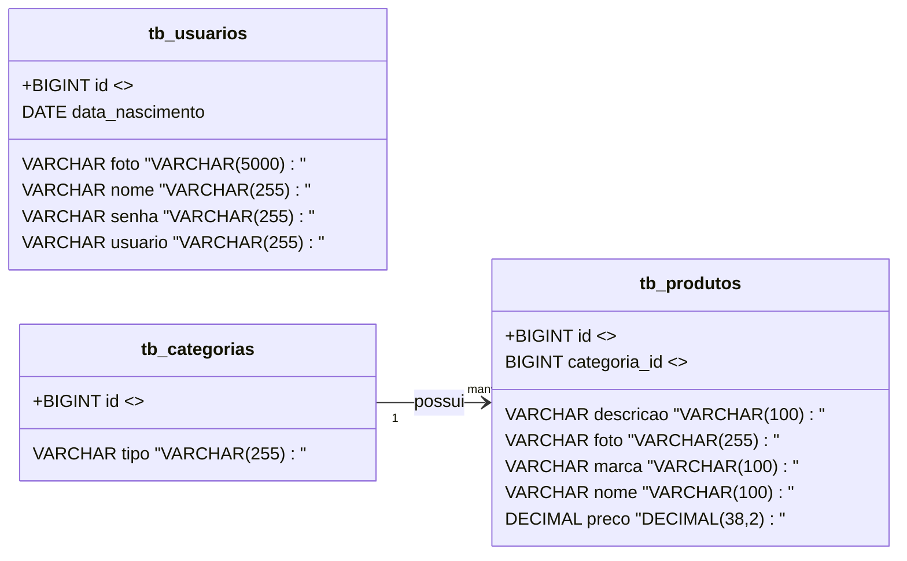

# Projeto Farmácia - Backend com Spring Boot
 
<br />
 
<div align="center">

</div>
 
<br />
 
<div align="center">


 
</div>
 
<br />
 
## 1. Descrição
 
<br />
 
O projeto **Farmácia E-commerce** consiste no desenvolvimento do **Backend** para um sistema de comércio eletrônico focado em produtos de saúde, medicamentos, cosméticos e higiene. Esta aplicação simula um sistema de gerenciamento de estoque e catálogo, onde os **Produtos** são cadastrados e obrigatoriamente classificados por **Categorias**.
 
Este projeto foi desenvolvido como **Atividade Prática (Performance Goal Check - Bloco 02)** proposta pela Generation Brasil, focado na aplicação dos conceitos de API REST, persistência de dados e boas práticas com Spring Boot, incluindo o mapeamento de relacionamentos entre entidades.
 
<br />
 
## 2. Sobre esta API
 
<br />
 
A API da Farmácia E-commerce foi desenvolvida utilizando **Java** e o **framework Spring Boot**, seguindo a arquitetura em camadas (Model, Repository, Controller) e os princípios REST. O foco da API é o gerenciamento completo do CRUD (6 métodos) para os recursos `Categoria` e `Produto`.
 
<br />
 
### 2.1. Principais funcionalidades da API:
 
<br />
 
1. **CRUD Completo (6 métodos)** para o recurso **Produto** e **Categoria**.
2. Implementação do **Relacionamento One-to-Many Bidirecional** entre Categoria e Produto.
3. Utilização de **Spring Data JPA** para conexão com o banco de dados **MySQL**.
4. Testes e validação de todos os 12 endpoints via Insomnia.

<br />
 
## 3. Diagrama de Classes
 
<br />
 
O diagrama abaixo representa a estrutura e o relacionamento entre as principais entidades do projeto.

<br />
 

 
<br />
 
## 4. Diagrama Entidade-Relacionamento (DER)
<br />

O DER (Diagrama Entidade-Relacionamento) representa como os dados estão estruturados e interligados no banco de dados relacional (MySQL).


<div align="center">c
	

</div>>

 
## 5. Tecnologias utilizadas
 
<br />
 
| Item                          | Descrição       |
| ----------------------------- | --------------- |
| **Servidor**                  | Tomcat          |
| **Linguagem de programação**  | Java            |
| **Framework**                 | Spring Boot     |
| **ORM**                       | JPA + Hibernate |
| **Banco de dados Relacional** | MySQL           |
| **Validação**                 | Jakarta         |
| **Build Tool**                | Maven           |
| **Autenticação**              | JWT             |
| **Ambiente de Teste**         | Insomnia        |
 
<br />
 
## 6. Requisitos
 
<br />
 
Para executar os códigos localmente, você precisará:
 
- [Java JDK 17+](https://www.oracle.com/java/technologies/javase/jdk17-archive-downloads.html)
- Banco de dados [MySQL](https://dev.mysql.com/downloads/)
- [STS](https://spring.io/tools)
- [Insomnia](https://insomnia.rest/download)
 
<br />
 
## 7. Como Executar o projeto no STS
 
<br />
 
### 7.1. Importando o Projeto
 
1. Clone o repositório do Projeto [Farmácia](https://github.com/MyListon/projeto_final_bloco_02) dentro da pasta do *Workspace* do STS
 
```bash
git clone https://github.com/MyListon/projeto_final_bloco_02.git
```
 
2. **Abra o STS** e selecione a pasta do *Workspace* onde você clonou o repositório do projeto
3. No menu superior do STS, clique na opção: **File 🡲 Import...**
4. Na janela **Import**, selecione a opção: **General 🡲 Existing Projects into Workspace** e clique no botão **Next**
5. Na janela **Import Projects**, no item **Select root directory**, clique no botão **Browse...** e selecione a pasta do Workspace onde você clonou o repositório do projeto
6. O STS reconhecerá o projeto automaticamente
7. Marque o Projeto Loja de Games no item **Projects** e clique no botão **Finish** para concluir a importação
 
<br />
 
### 7.2. Executando o projeto
 
1. Na Guia **Boot Dashboard**, localize o  **Projeto Farmácia**
2. Selecione o **Projeto Loja de Games**
3. Clique no botão **Start or Restart**  para iniciar a aplicação
4. Caso seja perguntado se você deseja autorizar o acesso ao projeto via rede, clique no botão **Permitir Acesso**
5. Acompanhe a inicialização do projeto no console do STS
6. Verifique se o banco de dados `db_farmacia` foi criado corretamente e se as tabelas foram geradas automaticamente.
7. Utilize o [Insomnia](https://insomnia.rest/).
 
<br />
 
> [!TIP]
>
> Ao acessar a URL `http://localhost:8081` em seu navegador, a interface do Swagger será carregada automaticamente, permitindo a visualização e a interação com os endpoints da API, bem como a consulta dos modelos de dados utilizados.
 
<br />
 
##  10. Contato
 
<br />
 
Desenvolvido por [**Myriam**](https://github.com/MyListon)
Para dúvidas, sugestões ou colaborações, entre em contato via GitHub ou abra uma issue!